# Screenshots - Assistance Immediately

## Main Features

### Dashboard
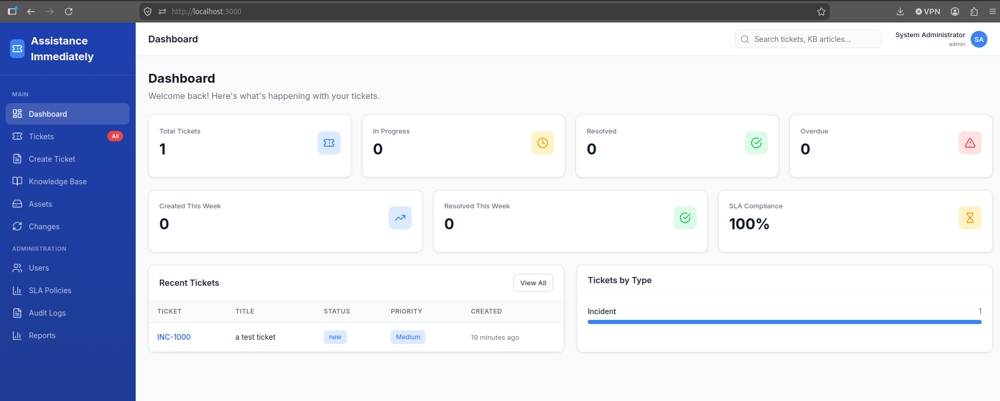

Overview of total tickets, in progress, resolved, overdue counts, weekly stats, SLA compliance, recent tickets table, and tickets by type distribution.

### Ticket Detail
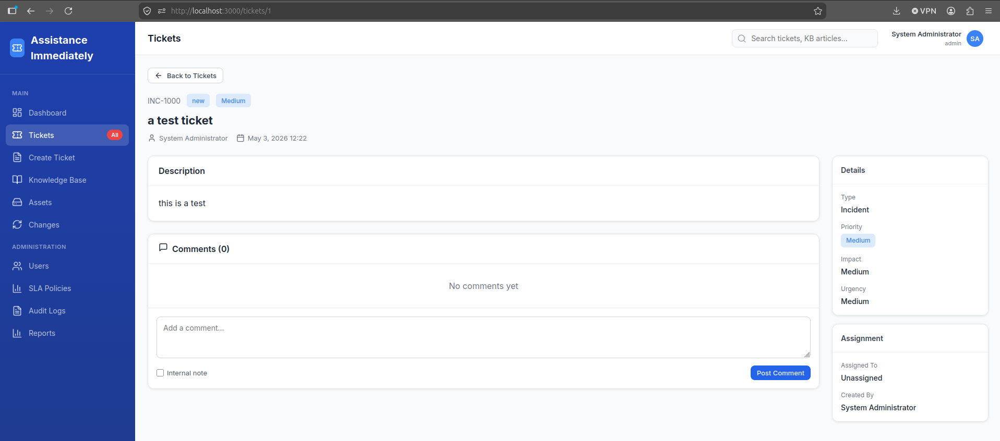

Full ticket view showing ticket number, status, priority badges, description, comments section with internal note option, and sidebar with details and assignment panels.

### Create Ticket
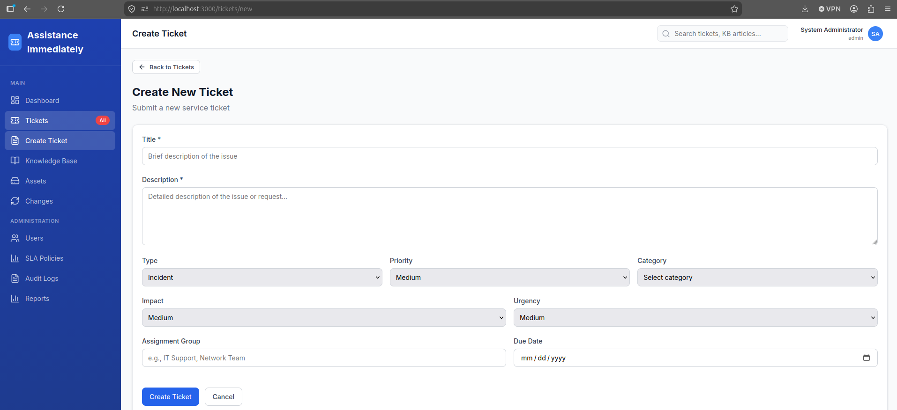

Ticket creation form with fields for title, description, type, priority, category, impact, urgency, assignment group, and due date.

## Knowledge & Assets

### Knowledge Base
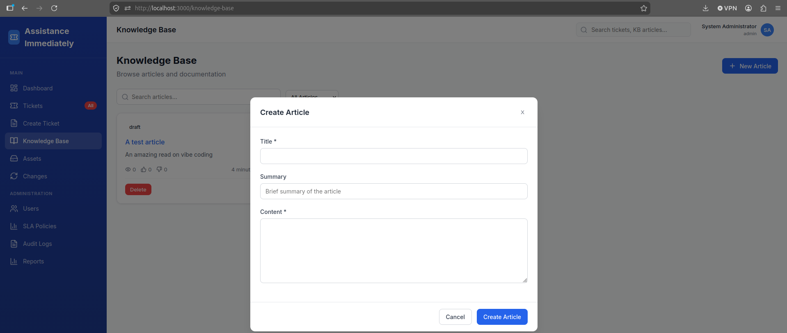

Knowledge base article listing with search, status filters, view counts, and helpfulness ratings.

### Assets
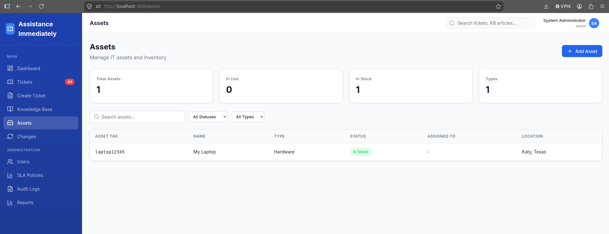

IT asset inventory management showing asset tag, name, type, status, assignment, and location tracking.

## Change Management

### Change Requests
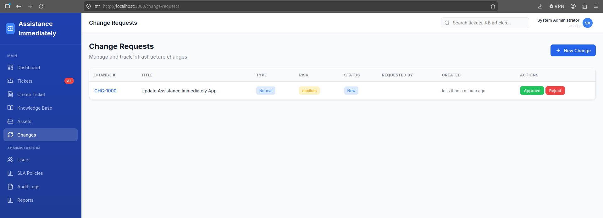

Change request listing with change numbers, types, risk levels, status tracking, and approval actions.

### Create Change Request
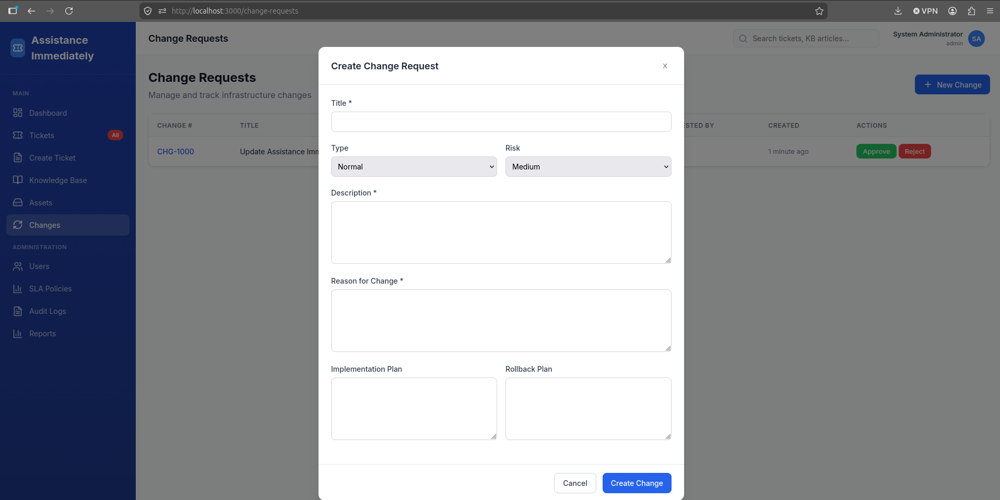

Change request creation form with title, type, risk, description, reason, implementation plan, and rollback plan fields.

## Administration

### Users
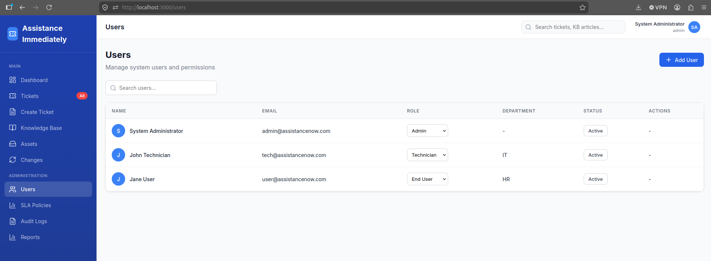

User management panel with role assignment dropdowns, department info, active/inactive status toggles, and search.

### SLA Policies
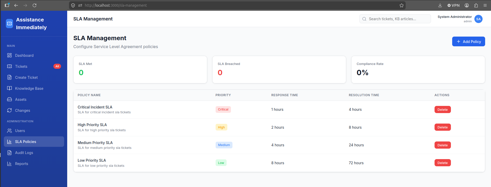

SLA policy configuration showing response and resolution time targets per priority level, with compliance statistics.

### Audit Logs
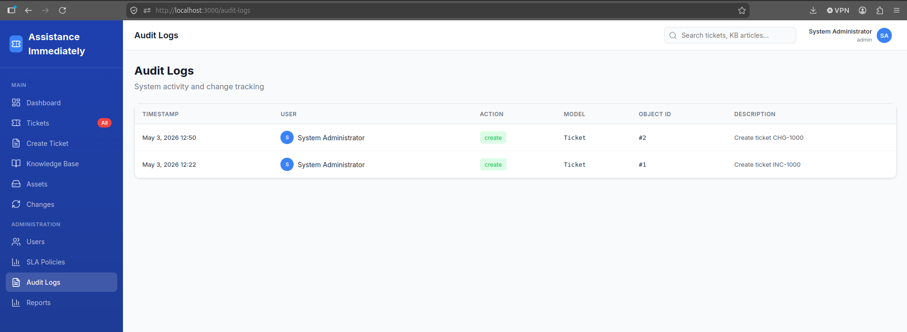

System audit trail with timestamps, user actions, model targets, and change descriptions.

### Reports
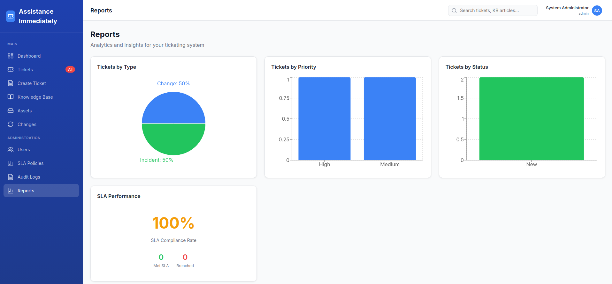

Analytics dashboard with ticket statistics, charts for tickets by type/priority/status, and SLA compliance metrics.
